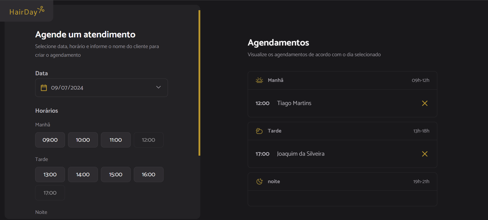

# Projeto Hair Day

Projeto com foco em javascript puro, sem uso de frameworks, para um agendamento de salão de beleza.

Foi utilizado o webpack junto com o babel para melhorar o desempenho e portabilidade da aplicação.

Para simular a api de agendamento foi utilizado o json-server.

Demo: <https://tiagomartinscc.github.io/HairDay/>

